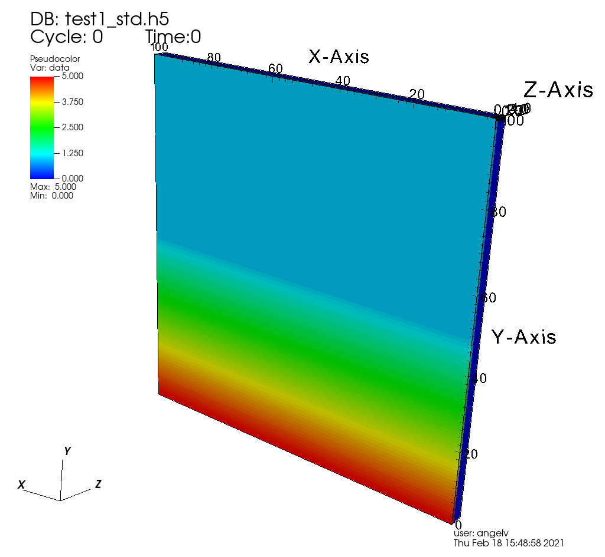
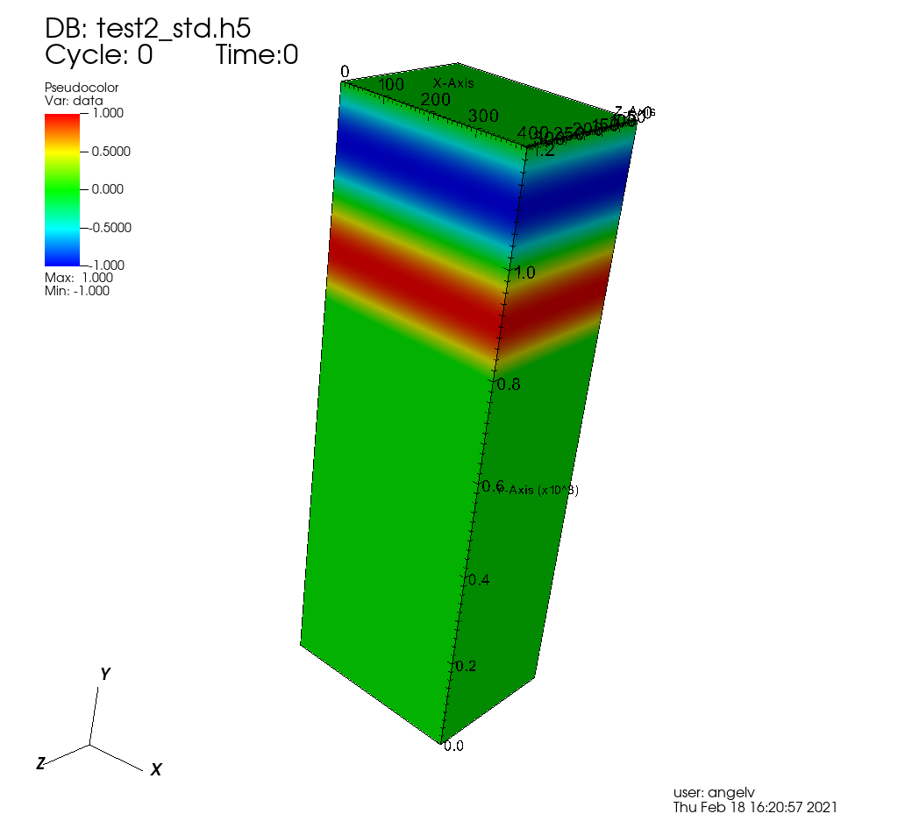
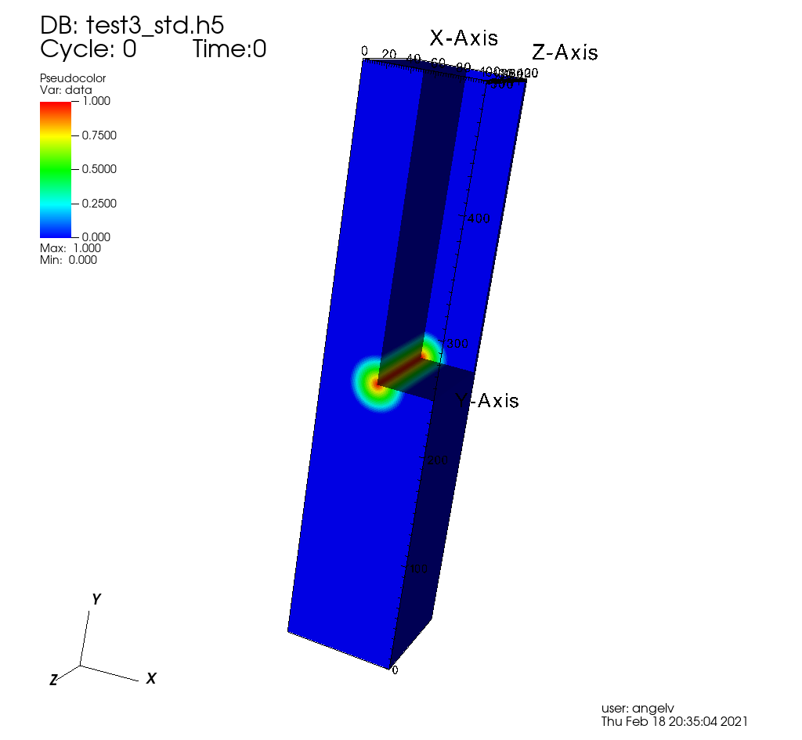

# Table of Contents

1.  [Rules Based Sparse Like Arrays](#orgb2d119d)
    1.  [Rules for 3D arrays](#orgbd2b2b0)
        1.  [d1 rules](#orgc12786f)
        2.  [d2 rules](#org43f3dc2)
        3.  [Explicit data values](#org5a2119b)
    2.  [Creating test arrays (\`Test\_Files/test.py\`)](#orgb689b6c)
        1.  [Test 1](#org149a91d)
        2.  [Test 2](#org146d050)
        3.  [Test 3](#org41cee88)
    3.  [In-memory RBSLA (C code)](#org8b97dec)
        1.  [Verification of correct implementation.](#org88d9cb2)
        2.  [Verification of reduced memory size of RBSLA in-memory structure](#org051f3b3)

# Rules Based Sparse Like Arrays

Arrays are usually stored in memory as dense arrays (where every element of the
array is stored in memory) or as sparse arrays (where only non-zero values are
stored. These are usually used for arrays that have a small fraction of their
values as non-zero values, usually in or near the diagonals. Sparse arrays can
be implemented in different ways).

For some applications, when we might have non-zero values anywhere in the array,
but many of the array positions have the same value, we might approach the
storage of these arrays in a different way. This is what we do here for 3D
arrays with what we call Rules Based Sparse Like Arrays, which in certain cases
can be used to store the arrays (both in disk and in memory) in a much more
compact way than its equivalent dense array representation (using orders of
magnitude less space).

(graphical explanation of the building up of the RBSLA to be added)

## Rules for 3D arrays

In this version, the available rules to define RBSLA data are only two and are
very simple. The test arrays created with the \`test.py\` script should help to
clarify how these rules are used.

### d1 rules

With these rules we restrict the range in the first dimension. In pseudo-code
this would represent statements such as:

    a[1,:,:]   = value
    a[2:4,:,:] = value

so that a range in the first dimension is given, but the second and third
dimensions cannot be sub-ranged.

These rules are given by just three values: 

    d1_s d1_e val

where d1\_s is the beginning of the range in the first dimension, d1\_e is the
end of the range in the first dimension, and val is the value to be set for
that sub-array.

Thus, the pseudo-code

    a[1,:,:]   = 0.0
    a[2:5,:,:] = 2.0

would be given by the d1 rules

    1 1 0.0
    2 5 2.0

### d2 rules

These rules are very similar to d1 rules, but in this case, we can give
sub-ranges for both the first and the second dimensions. These rules are given
by five values (similar to d1 rules, but now we also provide beginning and end
ranges for the second dimension):

    d1_s d1_e d2_s d2_e val

Thus, the pseudo-code

    a[1,2:4,:]   = 0.0
    a[2:5,3:9,:] = 2.0

would be given by the d2 rules

    1 1 2 4 0.0
    2 5 3 9 2.0

### Explicit data values

For those values that cannot be represented with the above rules, we provide
as many dense sub-arrays as necessary, where we also specify the location where
the sub-array fits in the main array. 

## Creating test arrays (\`Test\_Files/test.py\`)

The Python script \`test.py\` creates three "rules-based" and "standard" arrays,
storing them in HDF5 format. As we can see below, the size of the "rules-based"
files (\`testX\_rules.h5\`) is much smaller than the "standard" files
(\`testX\_std.h5\`). How much smaller depends on how efficiently the rules format
(explained below) can represent the data of interest.

    $ ./test.py
    Creating rules-based file for test1 (4x100x100)
    Creating starndard file for test1 (4x100x100:  0.31 MB)
    Creating rules-based file for test2 (300x1200x400)
    Creating starndard file for test2 (300x1200x400: 1098.63 MB)
    Creating rules-based file for test3 (100x500x100)
    Creating starndard file for test3 (100x500x100: 38.15 MB)
    
    $ ls -ltrh *h5
    -rw-r--r-- 1 angelv angelv 3.2K Feb 19 19:01 test1_rules.h5
    -rw-r--r-- 1 angelv angelv 315K Feb 19 19:01 test1_std.h5
    -rw-r--r-- 1 angelv angelv  17K Feb 19 19:01 test2_rules.h5
    -rw-r--r-- 1 angelv angelv 1.1G Feb 19 19:02 test2_std.h5
    -rw-r--r-- 1 angelv angelv 3.9M Feb 19 19:04 test3_rules.h5
    -rw-r--r-- 1 angelv angelv  39M Feb 19 19:04 test3_std.h5

### Test 1

In this first test, all the planes (except for the first one) in the array first
dimension (Z axis in the image below) are set to 0. In the first plane, the
values in the second dimension (Y axis in the image) range from 5 at the bottom
to 1 at the center, and are set to 1 in the top half, while being constant for
the third dimension (X axis in the image).

In pseudo-code, this array could be created as:

    a[1:,:,:] = 0
    a[0,0:half_d2,:] = linspace(5,1)
    a[0,half_d2:,:] =  1

The \`test.py\` array creates for this test an array with dimensions 4x100x100,
and we can see the rules with:

    $ h5dump -A test1_rules.h5
    HDF5 "test1_rules.h5" {
    GROUP "/" {
       ATTRIBUTE "d1" {
          DATATYPE  H5T_IEEE_F64LE
          DATASPACE  SIMPLE { ( 1, 3 ) / ( 1, 3 ) }
          DATA {
          (0,0): 1, 3, 0
          }
       }
       ATTRIBUTE "d2" {
          DATATYPE  H5T_IEEE_F64LE
          DATASPACE  SIMPLE { ( 51, 5 ) / ( 51, 5 ) }
          DATA {
          (0,0): 0, 0, 50, 99, 1,
          (1,0): 0, 0, 0, 0, 5,
          (2,0): 0, 0, 1, 1, 4.91837,
          [...]
          (49,0): 0, 0, 48, 48, 1.08163,
          (50,0): 0, 0, 49, 49, 1
          }
       }
       ATTRIBUTE "dims" {
          DATATYPE  H5T_STD_I32LE
          DATASPACE  SIMPLE { ( 3 ) / ( 3 ) }
          DATA {
          (0): 4, 100, 100
          }
       }
    }
    }

We can see that this array can be expressed only with d1 and d2 rules, without
explicit sub-array datasets, so the rules-based file uses only 3 KB, while the
standard file takes 322 KB.

### Test 2

In the second test, the bottom 2/3 of the domain is set to 0 for all depths,
while the top 1/3 of the domain is set to a sin wave. In pseudo-code:

    a[0:,0:2/3*d2,:] = 0
    a[0:,2/3*d2:,:]  = sin

By looking at the \`test.py\` script or the \`test2\_rules.h5\` file created by it,
we can see that this file can be created only with d2 rules, and since the
created domain is very large (300x1200x400), the space saved is huge (17 KB as
compared to ~1 GB).

### Test 3

In the third test, all the domain is set to 0, except for a **cylinder** that goes
from the front to the back of the domain, with values for the **cylinder** ranging
from 0 to 1 (at the centre of cylinder axis). 

This file cannot be created only with d1 or d2 rules, since we have variation
along the third dimension (X axis in the image) in some part of the domain. So,
for this test we can provide rules for the values outside of the region where
the **cylinder** is located, but for the sub-array where the cylinder is, we need
to provide a dense sub-array. In the HDF5 file we give this explicit dense
sub-array as the dataset "cylinder", giving also the location where the
sub-array **fits** within the large array (by giving the beginning and ending
positions in the second dimension as the "d2" attribute).

    DATASET "cylinder" {
       DATATYPE  H5T_IEEE_F64LE
       DATASPACE  SIMPLE { ( 100, 51, 100 ) / ( 100, 51, 100 ) }
       ATTRIBUTE "d1" {
          DATATYPE  H5T_STD_I64LE
          DATASPACE  SIMPLE { ( 2 ) / ( 2 ) }
          DATA {
          (0): 0, 99
          }
       }
       ATTRIBUTE "d2" {
          DATATYPE  H5T_STD_I64LE
          DATASPACE  SIMPLE { ( 2 ) / ( 2 ) }
          DATA {
          (0): 225, 275
          }
       }
    }

We can provide as many dense sub-arrays as needed to provide values for all the
values which could not be specified with d1 or d2 rules.

In this case, since we have to provide a dense sub-array covering 1/10 of the
whole domain, the saving in space is not as large as in Test 1 or Test2 (4 MB as
compared to 40 MB).

## In-memory RBSLA (C code)

In directory \`C\` we have the C code to read these rule-based arrays and create
an efficient in-memory representation of these RBSLA arrays.

### Verification of correct implementation.

To make sure that the C code can correctly read the rules-based files and store them in
the RBSLA in-memory structure, run the following (it assumes that you have run
\`test.py\` in the \`Test\_Files\` directory, so that the files \`testX\_rules.h5\`
exist):

    $ make clean
    $ make PP="-DVERF" 
    $ ./rbsla 

In this mode, \`rbsla\` will (for each test) read the rules-based file and after
storing the data in the RBSLA in-memory structure, it will create also in
\`Test\_Files\` the standard (expanded) files, as \`testX\_std\_C.h5\`. We can verify
that the C created files are bit-to-bit identical to the ones generated with
Python by doing:

    $ for i in `seq 1 3` ; do echo "Comparing $i" ; h5diff ../Test_Files/test${i}_std.h5 ../Test_Files/test${i}_std_C.h5 ; done
    Comparing 1
    Comparing 2
    Comparing 3
    $

In order to create the standard array in the file, we allocate a complete dense
array in memory, so if we profile the memory used by this code, we will not see
the memory savings as compared to a standard dense array implementation.

### Verification of reduced memory size of RBSLA in-memory structure

An easy way to compare the memory saved when using the RBSLA in-memory structure
is using the \`time\` GNU command (not the Bash built-in one), usually installed
in \`/usr/bin/time\`:

    $ /usr/bin/time --version
    time (GNU Time) UNKNOWN
    Copyright (C) 2019 Free Software Foundation, Inc.

If we compile the code with \`make PP="-DVERF"\` as above, we call the
\`write\_regular\_file\` function, which allocates space to hold the complete dense
arrays before writing them to a file. We can see that the maximum resident size (in
KB) taken by this code is 1150608 (or ~1.2 GB),  which is roughly the size
required for the large array in Test 2:

    $ /usr/bin/time -f "%M" ./rbsla
    Reading dataset: cylinder
    1150608

If we compile the code with only \`make\`, the code also (for each test) reads the
rules-based file and stores the data in the RBSLA in-memory structure, but does
not call \`write\_regular\_file\`, and thus the space for the complete dense array
is not allocated. We can see that in this case the maximum resident size is only
~36MB, saving ~1.1 GB (basically the full size needed for the large Test 2, as
in this case, the rules-based representation can be done completely with rules). 

    $ /usr/bin/time -f "%M" ./rbsla
    Reading dataset: cylinder
    35968

